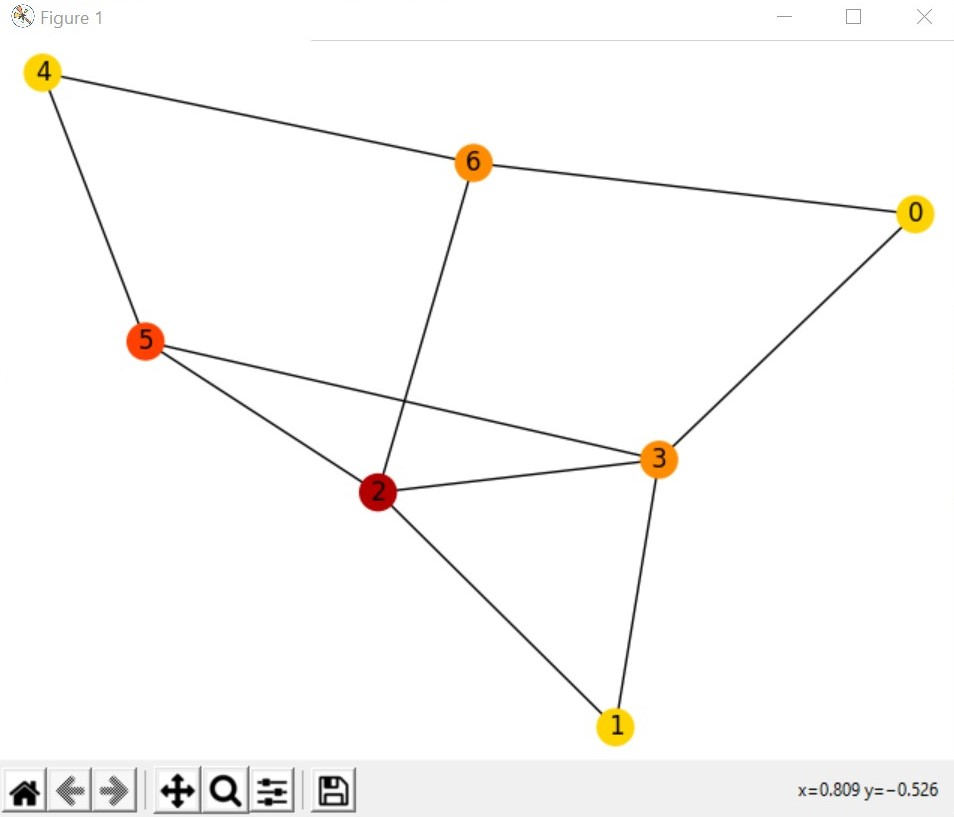
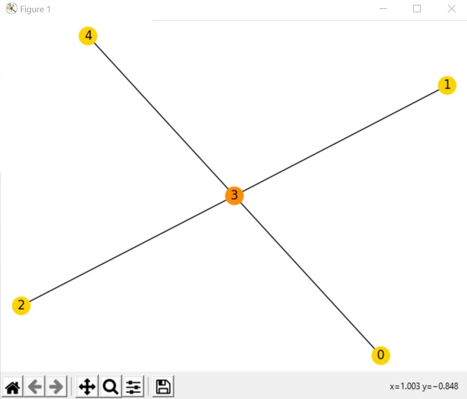

## Soving graph coloring problem with greedy algorithm

Graph coloring problem is an important problem of the graph theory. It has many applications such as solving a sudoku puzzle, solving an assignment problem or even map coloring problems.
In this repository I solve the graph coloring problem with the greedy algorithm using python.
With greedy algorithm, the algorithm starts with assigning a color to the first node and adding this color to a list, then proceedes to the other node, checks the nodes that are adjacent to it and removes their according colors if there are any. If the list of colors at the end of this procedure is empty, the node gets assigned a new color, if not, it gets assigned the first available color in the list.
The two following figures show the solutions for two different inputs. You can find the inputs and the solutions in the repository. 

The code I wrote is the following, which uses matplotlib and networkx libraries for graph drawing: 
`
from colour import Color
from copy import deepcopy
import networkx as nx
import matplotlib.pyplot as plt
D={}
C={}
color_map = ['#FFD300']
G= nx.Graph()
C[0]= Color(rgb=(1,0.827,0))
#Create list of colors with only black: 
List_Colors= [C[0]]
# First decide how many "nodes" we have: 
print("enter n")
n=input()
n=int(n)
for iteration in range(n):
	G.add_node(iteration)
	#G.nodes[iteration]=str(globals()['iteration'])
print(n)
for i in range(1,n):
	C[i] = 0 
for i in range(n):
	List_Copied=[]
	D[i]=[]
	print("enter number of adjacents to" , i)
	number = input()
	number= int(number)
	for l in range(number):
		print("enter adjacents to" ,i, "from 1 to" ,n)
		a = int(input())
		D[i].append(a)
		G.add_edge(i,a) 
	List_Copied = deepcopy(List_Colors)
	if i > 0:
		for j in D[i]:
			if List_Copied != []:
				if C[j] in List_Copied:
					List_Copied.remove(C[j])
		if List_Copied != []: 
			C[i] = List_Copied[0]
			value = List_Copied[0]
			color_map.append(str(globals()['value']))
		else:
			if i % 2 == 0: 
				C[i] = Color(rgb=((100-15*i)/100,0,0))
				List_Colors.append(C[i])
				new_color = Color(rgb=((100-15*i)/100,0,0))
				color_map.append(str(globals()['new_color']))
			else:
				C[i] = Color(rgb=(1,(100-15*i)/100,0))
				List_Colors.append(C[i])
				new_color = Color(rgb=(1,(100-15*i)/100,0))
				color_map.append(str(globals()['new_color']))
print(D)					
print(C)
print(G.nodes())
print(G.edges())
nx.draw(G, node_color=color_map,with_labels = True,)
plt.show()`

